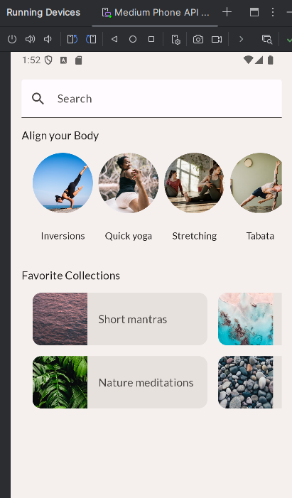

# Ejercicio 2 Jetpack compose

Código obtenido de [Basic Layouts in Compose Codelab](https://developer.android.com/codelabs/jetpack-compose-layouts)

## Screenshots



## Apuntes importantes

### 1. Imágenes

Para trabajar con imágenes existe una [documentación extendida](https://developer.android.com/develop/ui/compose/graphics/images?hl=es-419).

### 2. Ejemplo de un TextField extendido

```kotlin
TextField(
    value = "",
    onValueChange = {},
    leadingIcon = {
        Icon(
            imageVector = Icons.Filled.Search,
            contentDescription = null
        )
    },
    placeholder = { Text(stringResource(R.string.placeholder_search)) },
    )
```

### 3. Pasar como props recursos (drawable y string)

```kotlin
@DrawableRes image: Int,
@StringRes label: Int,

// Uso

Image(
    painter = painterResource(image),
    ...
)
Text(
    stringResource(label),
    ...
)
```

### 4. Column y Row trabajo con elementos

- **Column** EqualWeight, SpaceBetween, SpaceAround, SpaceEvenly, Start (LTR), Center, End (LTR)
- **Row** EqualWeight, SpaceBetween, SpaceAround, SpaceEvenly, Top, Center, Bottom

Para **gap entre elementos** spacedBy()

```kotlin
LazyRow(
    horizontalArrangement = Arrangement.spacedBy(8.dp),
)
```

### 5. Grid en jetpack

**IMPORTANTE** se debe importar items para grid no el que se tiene para LazyColRow
import androidx.compose.foundation.lazy.grid.items

```kotlin
LazyHorizontalGrid(
    rows = GridCells.Fixed(2),  // Cuantas filas se mostraran
    contentPadding = PaddingValues(horizontal = 16.dp), // Padding general del grid
    horizontalArrangement = Arrangement.spacedBy(16.dp), // Gap horizontal entre componentes
    verticalArrangement = Arrangement.spacedBy(16.dp), // Gap vertical entre componentes
    modifier = modifier.height(168.dp)  // Obligatorio para que el componente no ocupe todo el espacio
) {
    items(favoriteCollectionsData) { favoriteCollection ->
        FavoriteCollectionCard(
            image = favoriteCollection.drawable,
            label = favoriteCollection.text
        )
    }
}
```

### 6. Children en jetpack

Para mandar un componente como props

```kotlin
fun Padre (
    content: @Composable () -> Unit,
    texto: @StringRes text: Int
) {
    Text(stringResource(texto))
    content()
}

// Para invocar al Padre
Padre (texto = R.string.ejemplo) {
    Hijo ()
}
```

### 7. Overflow configurado para elementos limitados

Se puede usar LazyRow y LazyColumn para grandes cantidades de datos, pero si se tiene una cantidad limitada de elemntos se usa Column o Row y se actualiza su modifier.

```kotlin
Column(
    modifier.verticalScroll(rememberScrollState())
) {...}
```

### 8. Componentes interesantes

- **NavigationBar**, Barra inferior en dispositivos móviles para vertical
- ** NavigationRail**, Barra lateral en dispositivos móviles para horizontal
- **Scaffold** Componente general con innerPadding donde se puede introducir NavigationBar, AppBar, etc

### 9. Responsivo

Tres anchos.

- **Compact** App en Modo vertical
- **Medium** Todavía no se sabe
- **Expanded** App modo horizontal

```kotlin
import androidx.compose.material3.windowsizeclass.WindowSizeClass
import androidx.compose.material3.windowsizeclass.WindowWidthSizeClass
@Composable
fun MySootheApp(windowSize: WindowSizeClass) {
   when (windowSize.widthSizeClass) {
       WindowWidthSizeClass.Compact -> {
           MySootheAppPortrait()
       }
       WindowWidthSizeClass.Expanded -> {
           MySootheAppLandscape()
       }
   }
}

// En principal
import androidx.compose.material3.windowsizeclass.ExperimentalMaterial3WindowSizeClassApi
import androidx.compose.material3.windowsizeclass.calculateWindowSizeClass

class MainActivity : ComponentActivity() {
   @OptIn(ExperimentalMaterial3WindowSizeClassApi::class) // Experimental
   override fun onCreate(savedInstanceState: Bundle?) {
       super.onCreate(savedInstanceState)
       setContent {
           val windowSizeClass = calculateWindowSizeClass(this)
           MySootheApp(windowSizeClass)
       }
   }
}
```
